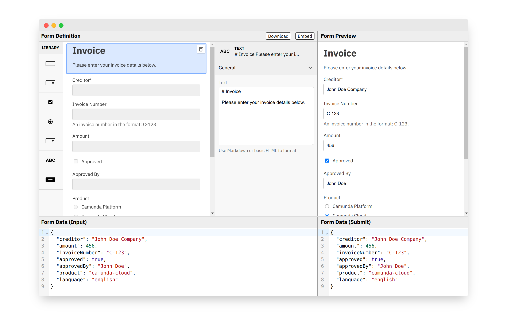

# @bpmn-io/form-js-playground

[](https://github.com/bpmn-io/form-js/actions?query=workflow%3ACI)

A tool to try out and explore [@bpmn-io/form-js](../form-js) in a playful manner.



## Usage

Integrate the playground into your application:

```javascript
import { Playground } from '@bpmn-io/form-js-playground';

const playground = new Playground({
  container: document.querySelector('#container'),
  schema,
  data,
});

const { schema, data } = playground.getState();
```

## Styling

For proper styling include the necessary stylesheets, and font used:

```html
<link
  href="https://fonts.googleapis.com/css2?family=IBM+Plex+Sans:ital,wght@0,400;0,600;1,400&display=swap"
  rel="stylesheet" />
<link href="https://fonts.googleapis.com/css2?family=IBM+Plex+Mono&display=swap" rel="stylesheet" />

<link rel="stylesheet" href="https://unpkg.com/@bpmn-io/form-js@0.10.0/dist/assets/form-js.css" />
<link rel="stylesheet" href="https://unpkg.com/@bpmn-io/form-js@0.10.0/dist/assets/form-js-editor.css" />
<link rel="stylesheet" href="https://unpkg.com/@bpmn-io/form-js@0.10.0/dist/assets/form-js-playground.css" />
```

## Resources

- [Demo](https://demo.bpmn.io/form)
- [Issues](https://github.com/bpmn-io/form-js/issues)

## License

Use under the terms of the [bpmn.io license](http://bpmn.io/license).
